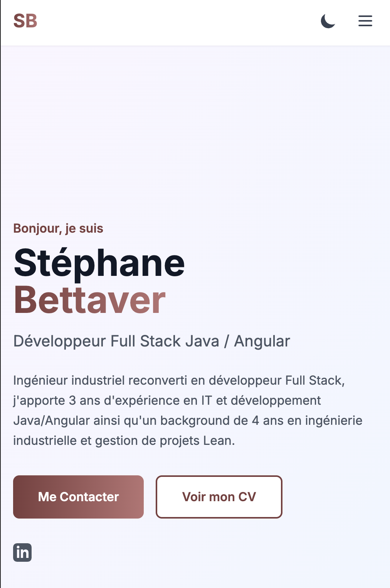

# 💻 Portfolio Développeur Fullstack


🚀 **Site en ligne** → [Mon Portfolio](https://my-gbtvr-portfolio.vercel.app)

Portfolio personnel moderne et performant réalisé avec **Angular 18** (standalone components), TypeScript et Tailwind CSS.

## 🏞️ Aperçu




## ✨ Fonctionnalités

- Architecture Angular standalone (plus de NgModule)
- Routing propre avec lazy-loading si besoin
- Services réutilisables (thème, scroll spy, icônes, CV)
- Pipes customs (`email-link`, `phone-format`)
- Mode sombre / clair automatique (localStorage + prefers-color-scheme)
- Animations subtiles au scroll (scroll-spy service)
- Formulaire de contact fonctionnel
- Téléchargement direct du CV (PDF)
- 100 % TypeScript strict
- Déploiement continu sur Vercel

## 🛠️ Stack technique

| Technologie  | Version | Rôle                |
| ------------ | ------- | ------------------- |
| Angular      | 18+     | Framework principal |
| TypeScript   | 5.x     | Typage fort         |
| Tailwind CSS | 3.x     | Styling             |
| Vercel       | -       | Hébergement & CI/CD |

## 🚀 Lancer le projet en local

```bash
git clone https://github.com/ton-pseudo/ton-portfolio.git
cd ton-portfolio
npm install
npm start
```

## 📂 Structure du projet

```tree
src/app/
├── components/         → Les composants de section
│   ├── home/
│   ├── projects/
│   ├── skills/
│   ├── experience/
│   ├── contact/
│   └── download-cv/
├── services/           → Logique réutilisable
│   ├── theme.service.ts
│   ├── scroll-spy.service.ts
│   ├── icons.service.ts
│   └── cv.service.ts
├── pipes/              → Pipes customs
├── models/             → Modèles et données portfolio
└── assets/             → CV.pdf + images projets
```

## Mes projets phares

Section en cours de construction...

## Contact

- 📧 Email : bettaver.stephane@gmail.com
- 💼 LinkedIn : https://www.linkedin.com/in/stephane-btvr/

N’hésite pas à laisser une ⭐ si le projet te plaît ou à me contacter pour toute opportunité !
